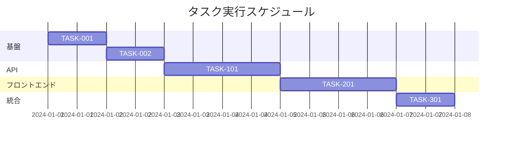

# kairo-tasks

## 目的

設計文書に基づいて実装タスクを分割し、依存関係を考慮した適切な順序で整理する。各タスクには実装詳細、テスト要件、UI/UX 要件を含める。

## 前提条件

- `docs/design/{要件名}/` に設計文書が存在する
- 設計がユーザによって承認されている（または承認が省略されている）
- `docs/tasks/` ディレクトリが存在する（なければ作成）

## 実行内容

1. **設計文書の分析**

   - `docs/design/{要件名}/architecture.md` を確認
   - `docs/design/{要件名}/database-schema.sql` を確認
   - `docs/design/{要件名}/api-endpoints.md` を確認
   - `docs/design/{要件名}/interfaces.ts` を確認
   - `docs/design/{要件名}/dataflow.md` を確認

2. **タスクの洗い出し**

   - 基盤タスク（DB 設定、環境構築など）
   - バックエンドタスク（API 実装）
   - フロントエンドタスク（UI 実装）
   - 統合タスク（E2E テストなど）

3. **依存関係の分析**

   - タスク間の依存関係を明確化
   - 並行実行可能なタスクを識別
   - クリティカルパスを特定

4. **タスクの詳細化**
   各タスクに以下を含める：

   - タスク ID（一意の識別子）
   - タスク名
   - タスクタイプ（TDD/DIRECT）
     - **TDD**: コーディング、ビジネスロジック実装、UI 実装、テスト実装など開発作業
     - **DIRECT**: 環境構築、設定ファイル作成、ドキュメント作成、ビルド設定など準備作業
   - 要件へのリンク
   - 依存タスク
   - 実装詳細
   - 単体テスト要件
   - 統合テスト要件
   - UI/UX 要件（該当する場合）
     - ローディング状態
     - エラー表示
     - モバイル対応
     - アクセシビリティ要件

5. **タスクの順序付け**

   - 依存関係に基づいて実行順序を決定
   - マイルストーンを設定
   - 並行実行可能なタスクをグループ化

6. **ファイルの作成**
   - `docs/tasks/{要件名}-tasks.md` として保存
   - 出力フォーマット例を確認して、出力フォーマット例に沿った情報を記載する
   - 各タスクにチェックボックスを追加してタスクの完了状況を追跡可能にする
   - 出力フォーマット例を確認して、出力フォーマット例に沿った情報が抜けていたら追加する

## 出力フォーマット例

````markdown
# {要件名} 実装タスク

## 概要

全タスク数: {数}
推定作業時間: {時間}
クリティカルパス: {タスク ID 列}

## タスク一覧

### フェーズ 1: 基盤構築

#### TASK-001: データベース初期設定

- [ ] **タスク完了**
- **タスクタイプ**: DIRECT
- **要件リンク**: REQ-401
- **依存タスク**: なし
- **実装詳細**:
  - PostgreSQL の Docker コンテナ設定
  - 初期スキーマの作成
  - マイグレーション設定
- **テスト要件**:
  - [ ] データベース接続テスト
  - [ ] スキーマ検証テスト
- **完了条件**:
  - [ ] データベースが起動している
  - [ ] 全テーブルが作成されている

#### TASK-002: バックエンド基本設定

- [ ] **タスク完了**
- **タスクタイプ**: DIRECT
- **要件リンク**: REQ-001, REQ-002
- **依存タスク**: TASK-001
- **実装詳細**:
  - Express/NestJS の初期設定
  - TypeScript 設定
  - 環境変数設定
- **テスト要件**:
  - [ ] サーバー起動テスト
  - [ ] ヘルスチェックエンドポイントテスト

### フェーズ 2: API 実装

#### TASK-101: ユーザー認証 API

- [ ] **タスク完了**
- **タスクタイプ**: TDD
- **要件リンク**: REQ-101, REQ-102
- **依存タスク**: TASK-002
- **実装詳細**:
  - JWT 認証の実装
  - ログイン/ログアウトエンドポイント
  - トークンリフレッシュ機能
- **テスト要件**:
  - [ ] 単体テスト: 認証ロジック
  - [ ] 統合テスト: ログインフロー
  - [ ] セキュリティテスト: トークン検証
- **エラーハンドリング**:
  - [ ] 無効な認証情報
  - [ ] トークン期限切れ
  - [ ] レート制限

### フェーズ 3: フロントエンド実装

#### TASK-201: ログイン画面

- [ ] **タスク完了**
- **タスクタイプ**: TDD
- **要件リンク**: REQ-101
- **依存タスク**: TASK-101
- **実装詳細**:
  - React/Vue/Angular コンポーネント
  - フォームバリデーション
  - エラー表示
- **UI/UX 要件**:
  - [ ] ローディング状態: ボタン無効化 + スピナー
  - [ ] エラー表示: トースト通知
  - [ ] モバイル対応: レスポンシブデザイン
  - [ ] アクセシビリティ: ARIA 属性、キーボード操作
- **テスト要件**:
  - [ ] コンポーネントテスト
  - [ ] E2E テスト: ログインフロー
  - [ ] レスポンシブテスト

### フェーズ 4: 統合・最適化

#### TASK-301: E2E テストスイート

- [ ] **タスク完了**
- **タスクタイプ**: TDD
- **要件リンク**: 全要件
- **依存タスク**: TASK-201
- **実装詳細**:
  - Cypress/Playwright セットアップ
  - 主要ユーザーフローのテスト
  - CI/CD 統合

## 実行順序


````

## サブタスクテンプレート

### TDD タスクの場合

各タスクは以下の TDD プロセスで実装:

1. `tdd-requirements.md` - 詳細要件定義
2. `tdd-testcases.md` - テストケース作成
3. `tdd-red.md` - テスト実装（失敗）
4. `tdd-green.md` - 最小実装
5. `tdd-refactor.md` - リファクタリング
6. `tdd-verify-complete.md` - 品質確認

### DIRECT タスクの場合

各タスクは以下の DIRECT プロセスで実装:

1. `direct-setup.md` - 直接実装・設定
2. `direct-verify.md` - 動作確認・品質確認

```

## 実行後の確認
- 作成したファイルのパスを表示
- タスクの総数と推定時間を表示
- クリティカルパスを強調表示
- ユーザに実装開始の確認を促すメッセージを表示
```
