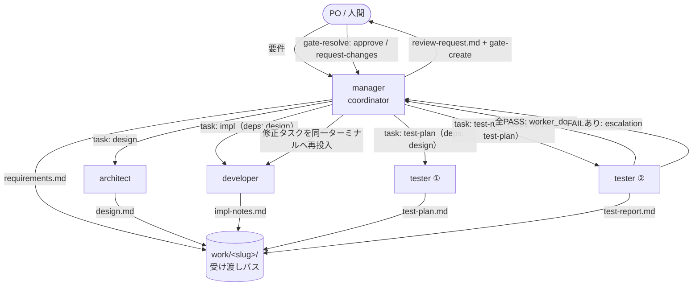

# Orca マルチエージェント開発フロー

HonoX + Cloudflare Pages ブログ「sun」の開発を、Orca orchestration 上で
**マネージャー / 設計 / 開発 / テスター** の 4 エージェントに分担して回すための仕組み。

- エージェント定義: [`.claude/agents/`](../../.claude/agents/)（`manager` / `architect` / `developer` / `tester`）
- 実行手順（コピペ可能なコマンド列）: [`runbook.md`](./runbook.md)
- サンプルの完全トレース: [`sample-task.md`](./sample-task.md)
- エージェント間の受け渡しファイル: [`work/`](./work/)（雛形は [`work/_TEMPLATE/`](./work/_TEMPLATE/)）

## 全体像

ポイント:

- **PO の対話窓口は manager だけ**。worker は PO と直接やり取りしない。
- **coordinator は manager だけ**。Orca の nested worker depth は既定 `1` なので
  worker は sub-dispatch できない。タスク分解は必ず manager が行う。
- 設計 → 実装 は直列だが、**test-plan は実装を待たず design 完了時点で並行**着手する。
  依存チェーンは 3〜4 段以内に保つ。

## Orca プリミティブとの対応

| フローの要素 | Orca orchestration |
|---|---|
| 案件の名前空間・coordinator の受信箱 | `run-create` |
| 作業項目（design / impl / test-plan / test-run） | `task-create`（`--deps` で DAG 化） |
| worker への割り当て（別ターミナル起動込み） | `worker-start`（低レベルは `worktree/terminal create` + `dispatch --inject`） |
| 完了報告 | `send --type worker_done --outcome succeeded/failed` |
| バグ差し戻し | `send --type escalation` → manager が修正 task を再 `worker-start --terminal <handle>` |
| worker → coordinator の確認 | `ask` / coordinator は `reply` |
| PO へのレビュー返却 | `gate-create` → PO が `gate-resolve` |
| coordinator の待機 | `check --wait --types worker_done,escalation,question`（sleep/poll しない） |
| 後始末 | settle 済み worker ごとに `worker-release`（引き継ぐ場合は release せず `--terminal` 再利用） |

## 情報伝達バス（ファイルベース）

エージェント間の受け渡しは **Orca メッセージ本文ではなく、既知パスのファイル**で行う。
メッセージ本文は「どのファイルを見ろ」＋短いサマリに留める（task spec は 160 字以内が目安 →
`task-list --brief` が読みやすくなる）。

案件ごとに `docs/orchestration/work/<slug>/` を作成（`_TEMPLATE/` をコピー）:

| ファイル | 書く人 | 読む人 |
|---|---|---|
| `requirements.md` | manager | architect / developer / tester |
| `design.md` | architect | developer / tester / manager |
| `impl-notes.md` | developer | tester / manager |
| `test-plan.md` | tester | developer / manager |
| `test-report.md` | tester | manager / developer（差し戻し時） |
| `review-request.md` | manager | PO |

`<slug>` は機能を表す kebab-case（例: `article-card-hashtag-badge`）。
完了案件のバスはブランチに残してレビュー履歴にする。

## 効率化のための既定値（ベストプラクティス由来）

- **worktree は共有**。worker ごとに fresh ターミナルを 1 つ起動（`--worktree current`）。
  setup 再実行なし・ブランチ状態共有・`yarn test` 一発。別 worktree は実ファイル競合など
  具体的理由がある時だけ。
- **モデル/努力度を役割で調整**: architect = `--model opus --effort high`、
  developer / tester = 既定（sonnet）。`worker-start` の `--model` / `--effort` で上書き。
- **差し戻しループはターミナル引き継ぎ**: developer の dispatch を `worker-release` せず、
  `worker-start --task <fix> --terminal <dev_handle>` で同じ worker に修正を渡す。
- **coordinator ループ**: `task-list --ready` を外部メモリに、`check --wait` を
  `--timeout-ms 900000` のローリング待機で回す。Delivery 内の全メッセージを処理してから `--ack`。
- **進捗可視化**: manager が節目で `orca worktree set --worktree active --comment/--workspace-status`。
- **メッセージ規律**: heartbeat/status は preamble が要求した時のみ。個別指示は `send --to dispatch:<id>`。

## 前提条件

1. Orca ランタイムが起動している（`orca status --json`）。
2. Settings › Experimental › **Orchestration** が有効。
3. Settings › Orchestration › **Nested worker depth = 1**（既定）。
4. 作業ブランチ上にいる（例: `chilitreat/feat-orca-multi-agent`）。
5. 依存関係インストール済み（`yarn install`）。
