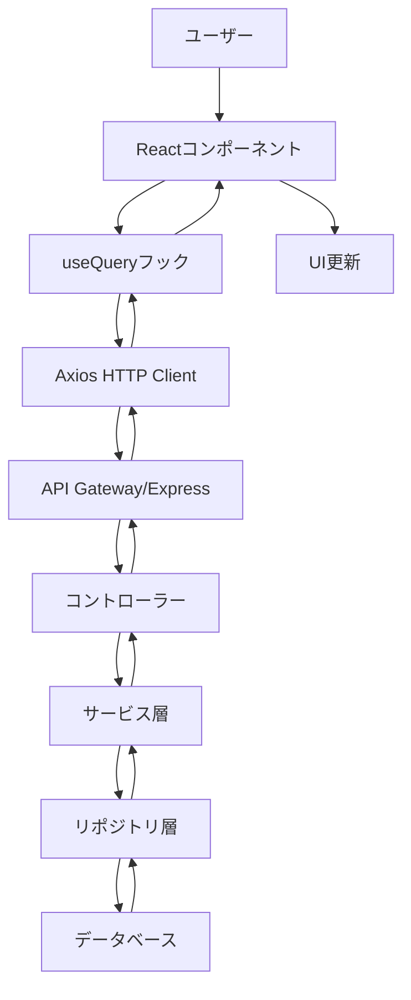
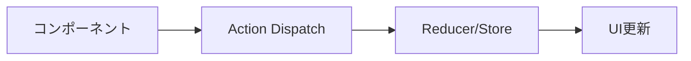

# データフロー図

## ユーザーインタラクションフロー

```mermaid
graph TD
A[ユーザー] --> B[Reactコンポーネント]
B --> C[useQueryフック]
C --> D[Axios HTTP Client]
D --> E[API Gateway/Express]
E --> F[コントローラー]
F --> G[サービス層]
G --> H[リポジトリ層]
H --> I[データベース]
I --> H
H --> G
G --> F
F --> E
E --> D
D --> C
C --> B
B --> J[UI更新]
```

## 状態管理フロー

```mermaid
flowchart LR
A[コンポーネント] --> B[Action Dispatch]
B --> C[Reducer/Store]
C --> D[UI更新]
```
