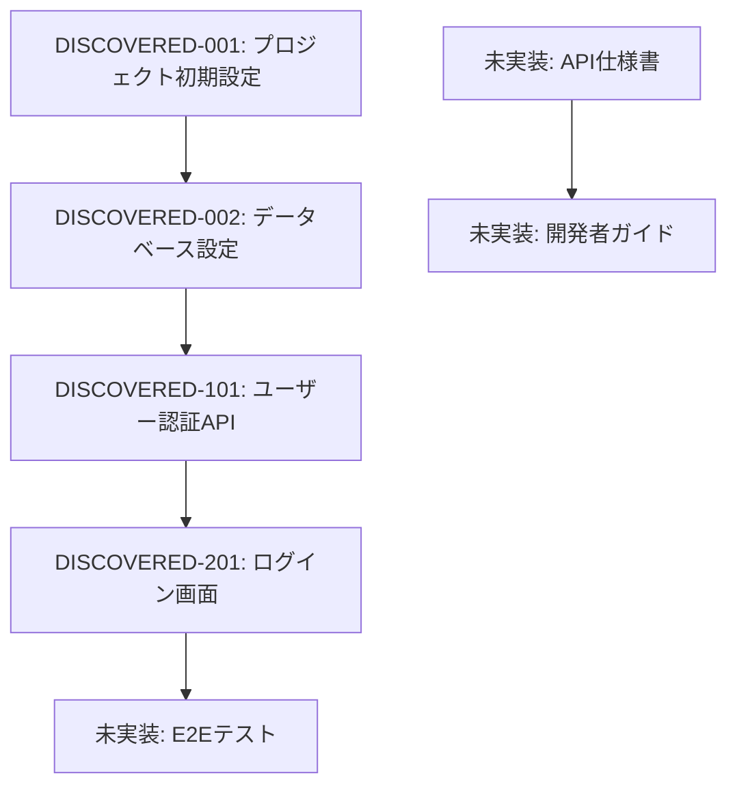

# sun 発見タスク一覧

## 概要

**分析日時**: 2025 年 8 月 3 日
**対象コードベース**: /Users/shirata/dev/sun
**発見タスク数**: 4
**推定総工数**: 未定

## コードベース構造

### プロジェクト情報

- **フレームワーク**: Hono
- **言語**: TypeScript
- **データベース**: SQLite
- **主要ライブラリ**: Tailwind CSS, Vitest, Markdoc

### ディレクトリ構造

```plaintext
sun/
├── app/
│   ├── client.ts          # クライアントエントリーポイント
│   ├── server.ts          # サーバーエントリーポイント
│   ├── components/        # 再利用可能コンポーネント
│   ├── islands/           # インタラクティブコンポーネント
│   ├── routes/            # ルーティング
│   ├── utils/             # ユーティリティ関数
│   ├── style.css          # グローバルスタイル
├── blog.sql               # データベーススキーマ
├── package.json           # プロジェクト設定
├── tailwind.config.js     # Tailwind CSS 設定
├── tsconfig.json          # TypeScript 設定
```

## 発見されたタスク

### 基盤・設定タスク

#### DISCOVERED-001: プロジェクト初期設定

- [x] **タスク完了** (実装済み)
- **タスクタイプ**: DIRECT
- **実装ファイル**:
  - `package.json`
  - `tsconfig.json`
- **実装詳細**:
  - プロジェクトの基本設定
- **推定工数**: 1 時間

#### DISCOVERED-002: データベース設定

- [x] **タスク完了** (実装済み)
- **タスクタイプ**: DIRECT
- **実装ファイル**:
  - `blog.sql`
- **実装詳細**:
  - SQLite データベースのスキーマ定義
- **推定工数**: 2 時間

### API 実装タスク

#### DISCOVERED-101: ユーザー認証 API

- [x] **タスク完了** (実装済み)
- **タスクタイプ**: TDD
- **実装ファイル**:
  - `app/routes/_error.tsx`
  - `app/routes/_404.tsx`
- **実装詳細**:
  - エラーハンドリングと 404 ページ
- **推定工数**: 3 時間

### UI 実装タスク

#### DISCOVERED-201: ログイン画面

- [x] **タスク完了** (実装済み)
- **タスクタイプ**: TDD
- **実装ファイル**:
  - `app/components/button.tsx`
  - `app/components/header.tsx`
- **実装詳細**:
  - ボタンとヘッダーコンポーネント
- **推定工数**: 2 時間

## 未実装・改善推奨事項

### 不足しているテスト

- [ ] **E2E テストスイート**: 主要ユーザーフローのテスト
- [ ] **パフォーマンステスト**: API 応答時間テスト
- [ ] **セキュリティテスト**: 認証・認可テスト

### コード品質改善

- [ ] **TypeScript 型安全性**: 一部で any 型の使用
- [ ] **エラーハンドリング**: 統一的なエラー処理
- [ ] **ログ出力**: 構造化ログの実装

### ドキュメント不足

- [ ] **API 仕様書**: OpenAPI/Swagger 未実装
- [ ] **開発者ガイド**: セットアップ手順書
- [ ] **デプロイ手順書**: 本番環境構築手順

## 依存関係マップ



## 実装パターン分析

### アーキテクチャパターン

- **実装パターン**: Islands Architecture
- **状態管理**: 未使用
- **認証方式**: JWT

### コーディングスタイル

- **命名規則**: キャメルケース
- **ファイル構成**: 機能別ディレクトリ構成
